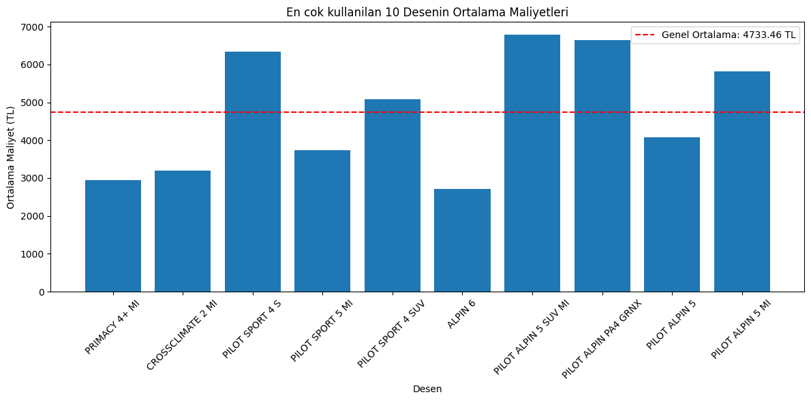
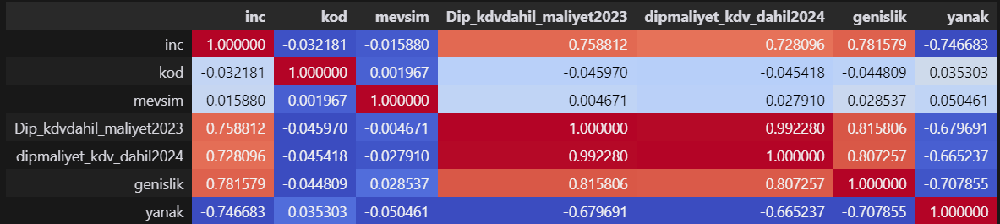
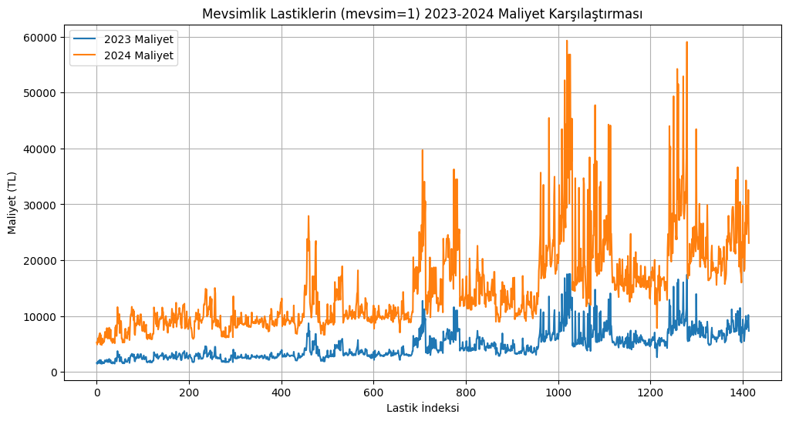
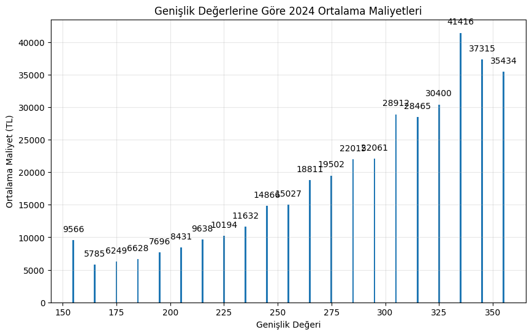
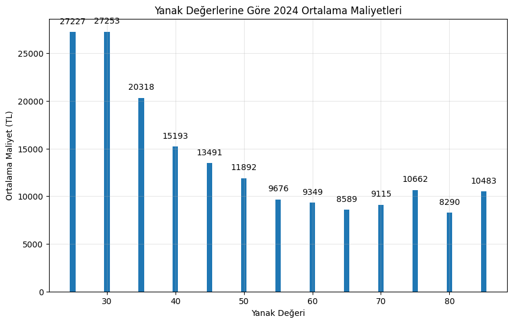
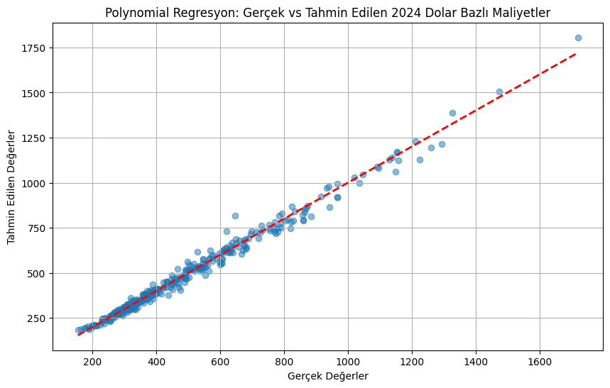
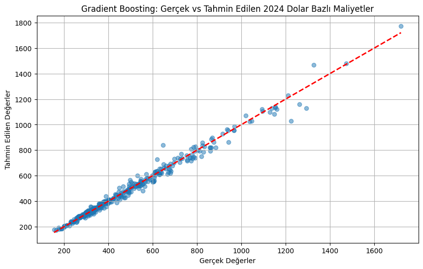
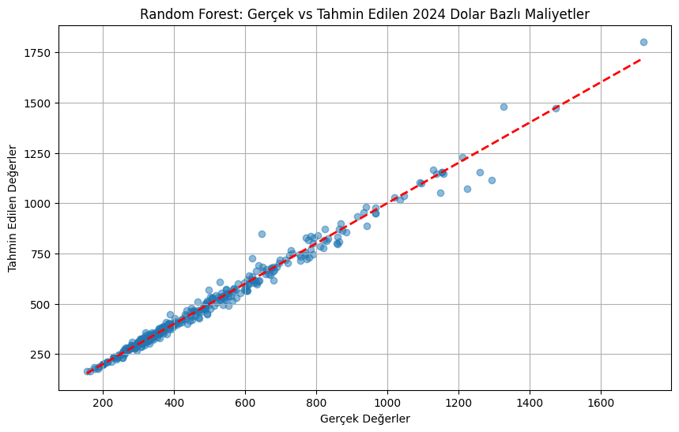
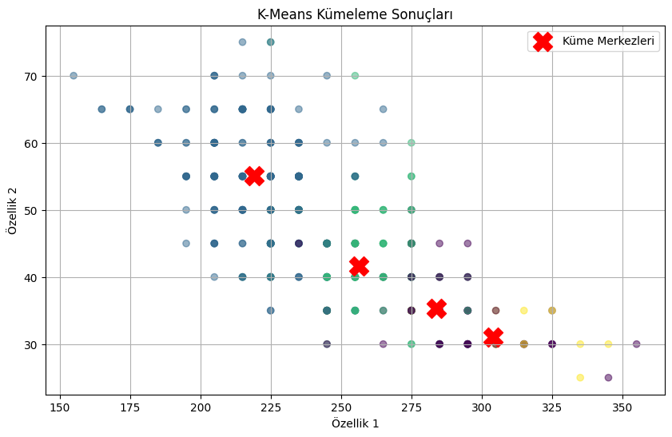

# Lastik Maliyet Analizi Projesi

## 📊 Proje Özeti

Bu proje, lastik sektöründeki maliyet değişimlerini analiz eden ve gelecek dönem tahminlemeleri yapan bir veri bilimi çalışmasıdır. 2023-2024 yılları arasında 1814 farklı lastik ürününün maliyet verilerini inceleyerek, sektördeki fiyat dinamiklerini ve etkileyen faktörleri ortaya çıkarmaktadır. Ayrıca, Express Otomotiv ve [Tiryakiler Otomotiv]([link](https://www.tiryakilerotomotiv.com/)) firmalarının gerçek Michelin lastik fiyat bilgileri de bu analizde yer almaktadır.

## 🎯 Amaç ve Kapsam

- Lastik maliyetlerindeki yıllık değişimlerin analizi
- Mevsimsel faktörlerin fiyatlandırmaya etkisinin incelenmesi
- Ebat bazlı maliyet farklılıklarının değerlendirilmesi
- Makine öğrenmesi ile maliyet tahmin modellerinin geliştirilmesi

Bu proje, lastik maliyetlerini analiz etmek için çeşitli veri bilimi tekniklerini kullanmaktadır. İlk olarak, veriler toplanmakta ve temizlenmektedir. Ardından, istatistiksel analizler ile verilerin temel özellikleri incelenmektedir. 

Makine öğrenmesi modelleri, geçmiş maliyet verilerini kullanarak gelecekteki maliyetleri tahmin etmek için eğitilmektedir. Lineer regresyon ve polinomial regresyon gibi modeller, maliyetlerin çeşitli değişkenlerle olan ilişkisini anlamak için kullanılmaktadır. Model performansı, Ortalama Kare Hata (MSE) ve R-kare (R²) gibi metriklerle değerlendirilmektedir. 

Sonuç olarak, bu proje, lastik maliyetlerindeki değişimleri anlamak ve gelecekteki fiyat tahminlerini yapmak için güçlü bir araç sunmaktadır.

## 📈 Önemli Bulgular

### Ortalama Fiyatlar

### Değişkenlerin Korelasyonu

### 2023 ve 2024 Fiyatlarının Karşılaştırması

### Maliyet Değişim Analizi

- 2023'ten 2024'e ortalama maliyet artışı: %218
- En yüksek artış gösteren lastik kategorisi: Kış

### Ebat Analizi Sonuçları

- Genişlik ve maliyet ilişkisi:

- Yanak oranının fiyata etkisi:

## 🤖 Makine Öğrenmesi Sonuçları

### Kullanılan Modeller ve Performansları

1. Lineer Regresyon

   Model Performans Metrikleri:
   - Ortalama Kare Hata (MSE): 787.24
   - R-kare (R²) Skoru: 0.99

    -Model Katsayıları:
    - Genişlik: 0.1770
    - Yanak: -0.2579
    - Maliyet 2023: -10.8103
    - inc: -15.7704
    - mevsim: 2.0107
    - Sabit (Intercept): 174.5347

2. Polinomial Regresyon

   Polynomial Regresyon Model Performans Metrikleri:
   - Ortalama Kare Hata (MSE): 736.64
   - R-kare (R²) Skoru: 0.99

3. Gradient Boosting Regresyon

   Gradient Boosting Regresyon Model Performans Metrikleri:
   - Ortalama Kare Hata (MSE): 903.32
   - R-kare (R²) Skoru: 0.99

4. Random Forest Regresyon

   Random Forest Regresyon Model Performans Metrikleri:
   - Ortalama Kare Hata (MSE): 846.55
   - R-kare (R²) Skoru: 0.99

5. K-Means Kümeleme

   K-Means Kümeleme Model Performans Metrikleri:
   Küme Sayısı: 4
   Küme Merkezleri:
   - Küme 1: Düşük maliyetli, dar genişlik, düşük yanak oranı
   - Küme 2: Orta maliyetli, geniş genişlik, orta yanak oranı
   - Küme 3: Yüksek maliyetli, geniş genişlik, yüksek yanak oranı
   - Küme 4: Çok yüksek maliyetli, dar genişlik, yüksek yanak oranı

## 📋 Veri Seti Özellikleri

- Toplam ürün sayısı: 1814
- Zaman aralığı: 2023-2024
- Analiz edilen özellikler:
  - İnç (lastik çap ölçüsü)
  - Ebat (genişlik/yanak)
  - Mevsim
  - Maliyet bilgileri

## 💡 Öneriler ve Sonuçlar

1. Maliyet Optimizasyonu:
   - Doların sert hareketlerinin fiyatlandırmalara doğrudan etkisi bulunmaktadır
   - Maliyetlerin izlenmesi ve analiz edilmesi için düzenli raporlar oluşturulmalıdır
   - Tedarik zinciri süreçlerinin optimize edilmesi, maliyetleri düşürebilir
   - Farklı tedarikçilerle fiyat karşılaştırmaları yapılarak en uygun maliyetli seçenekler belirlenmelidir
   
## 📚 Kullanılan Teknolojiler

- Python 3.x
- Pandas & NumPy: Veri analizi
- Scikit-learn: Makine öğrenmesi
- Matplotlib & Seaborn: Görselleştirme

## 👥 İletişim

- GitHub: [@YusufMerrt](https://github.com/YusufMerrt)
- LinkedIn: [Yusuf Mert Özkul](https://www.linkedin.com/in/yusuf-mert-%C3%B6zkul/)

